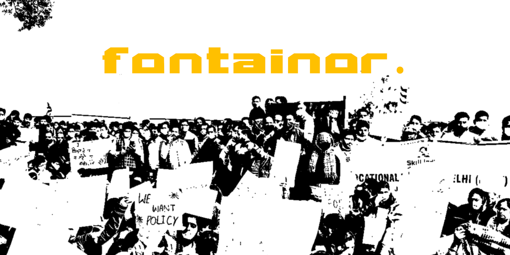

<p align="center">
  
</p>

# Fontainor Protocol

Fontainor is a high-performance, decentralized music equity registry and asset distribution protocol built on Arweave with trustless financial settlement via Solana. It provides a serverless platform for creators, allowing them to publish media and manage editorial content, with protocol nodes handling data-etching and payment splits.

---

**Production Link:** [https://fontainor-protocol.vercel.app](https://fontainor-protocol.vercel.app)

## 📐 Core Architectural Strengths

* **Serverless Audio Ingress Chunker:** Handles large files by breaking them into 256KB chunks in the browser for efficient, memory-safe streaming to Arweave.
* **Cryptographic Sovereign Identity:** Uses Phantom wallet signature verification for authentication, bypassing the need for a backend database.
* **Omni-Asset Stablecoin Transfers:** Supports native SOL, USDC, and USDT, executing a 98% artist / 2% treasury split directly on the Solana Mainnet-Beta network.
* **Type-Segregated Registry Mapping:** Explicitly separates `release` (audio) and `editorial` (text) content for efficient data management.

---

## 🏁 Quickstart

### 📦 1. Clone and install

```bash
git clone https://github.com/tapiwamakandigona/fontainor-protocol.git
cd fontainor-protocol
git checkout v06-development
npm install
```

### 🚀 2. Run locally

```bash
npm run dev        # frontend (Vite)
node api-server.js # API (Express, same function Vercel runs)
```

### ✅ 3. Verify and build

```bash
npm run ci         # typecheck + production build → dist/
```

Deployment: pushes to `v06-development` auto-deploy to Vercel (static `dist/` + `api/index.js` serverless function, see `vercel.json`).

---

## 🗂 Repo layout

- `src/` — React + TypeScript frontend (Vite, Tailwind v4)
- `api/` — Express serverless function (registry / upload / payment)
- `public/` — static assets incl. demo audio, covers, and fallback `registry.json`
- `api-server.js` — runs the same API locally (`npm start`)
- `docs/` — architecture, changelog, and design docs
- State files: `PROJECT.md` (decisions), `features.json` (definition of done), `progress.md` (append-only log)

---

## 📜 Open-Source Protocol Standards

Fontainor™ is free software licensed under the **GNU Affero General Public License v3.0 (AGPL-3.0-only)** — an un-censorable platform for creators to own their work and for users to stream music permanently.

What that means in practice:

- You can use, study, modify, and self-host Fontainor freely.
- If you run a **modified** version as a network service, you must make your modified source available to its users (AGPL §13).
- The license covers the code, **not the name**: forks must not call themselves Fontainor or present as the official deployment. See [`NOTICE`](NOTICE).

Full text in [`LICENSE`](LICENSE). Copyright (c) 2026 Alistair Fontaine and tapiwamakandigona.

## 💛 Support

Fontainor runs on a zero-burn stack — donations keep it that way and fund storage subsidies for artists who can't cover their own Arweave upload. See the in-app [Support page](https://fontainor-protocol-two.vercel.app/support) (SOL tip jar + more channels).
